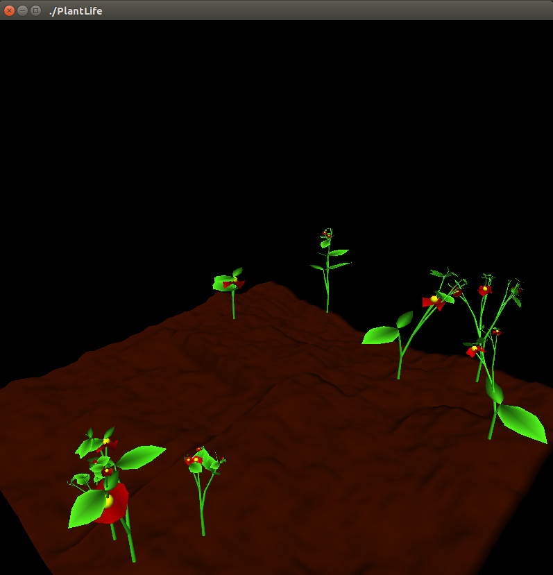

# Plant-Life
This Plant Life program is my fourth year computer graphics course work.

The objective of this program is to ~~learn how plants grow~~ implement objects as a hieracrchy related by transformations.

Here are what I implemented:
* L-system implementation
* Rendering of plants
* GUI controls
* Terrain generation

And some bonus implementations:
* Plant growth animation
* Texture mapping
* "Scatter" mode (When pressed, leaves and flowers become boids and fly around)

With the bonus implementations, I ended up getting 73 out of 50 on this assignment. (Yay!)

# Demo

